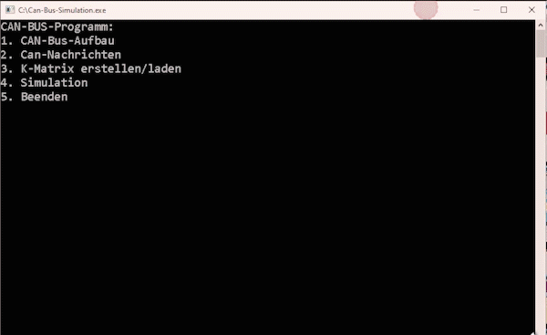
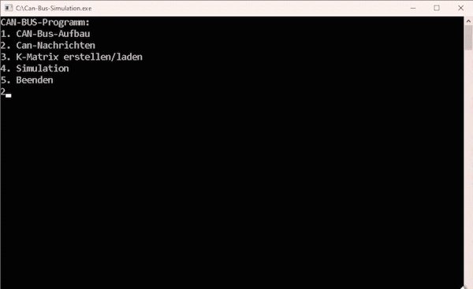
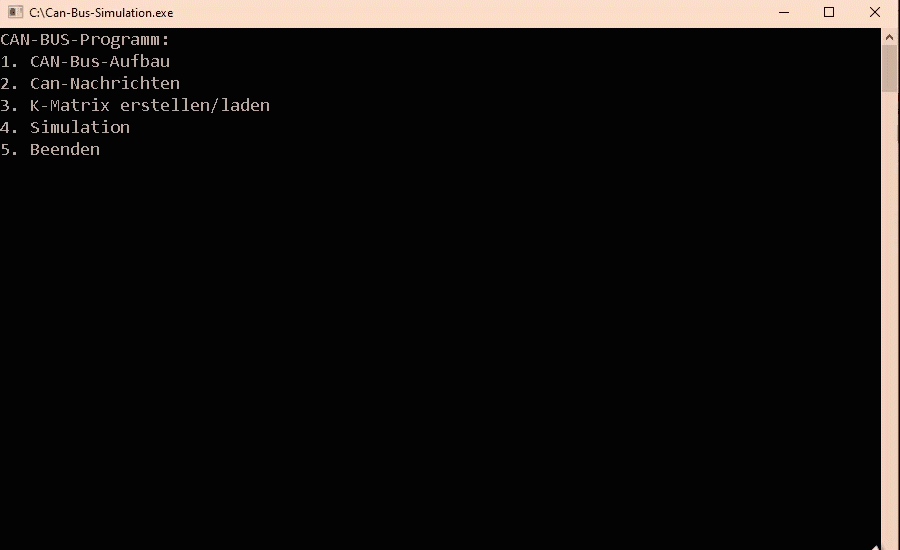

# Can-Bus-Simulation
Can bus simulation coded in plain C.

This is a proejct back from my studies which simulates a simple CAN network in C inside the windows console.
The user can define its own CAN architecture with specific nodes and messages.
Also a file export for the K-Matrix (automotive related communication matrix) is supported.


Create, Edit and inspect the CAN nodes:


Create messages for the specified CAN bus:


Run a simulation of the message flow:



Create the K-Matrix as summary:

```
KNOTEN:
ID	Name		Beschreibung
_____________________________________________________

1,	MCU,		Motor controller of vehicle engine

4,	Airbag-CU,		Airbag control unit

10,	Speed-Sens,		Vehicle speed sensor

11,	Angle-Sens,		Detects vehicle steering intent

15,	Yaw-Sens,		Detects vehicle actual yaw rate
-----------------------------------------------------
NACHRICHTEN:
Priorität	Empfänger	Sender	Name 		 Min.	 Max.	 Default.	 Sendeart	 Sendezyklus
____________________________________________________________________________________________________________________________

4,	       4,	       11,	    Driver steering intent,0,	180,	 90,	      1,	       5,	

5,	       4,	       15,	    Current vehicle yaw rate,0,	360,	 5,	       1,	       5,	
---------------------------------------------------------------------

```
